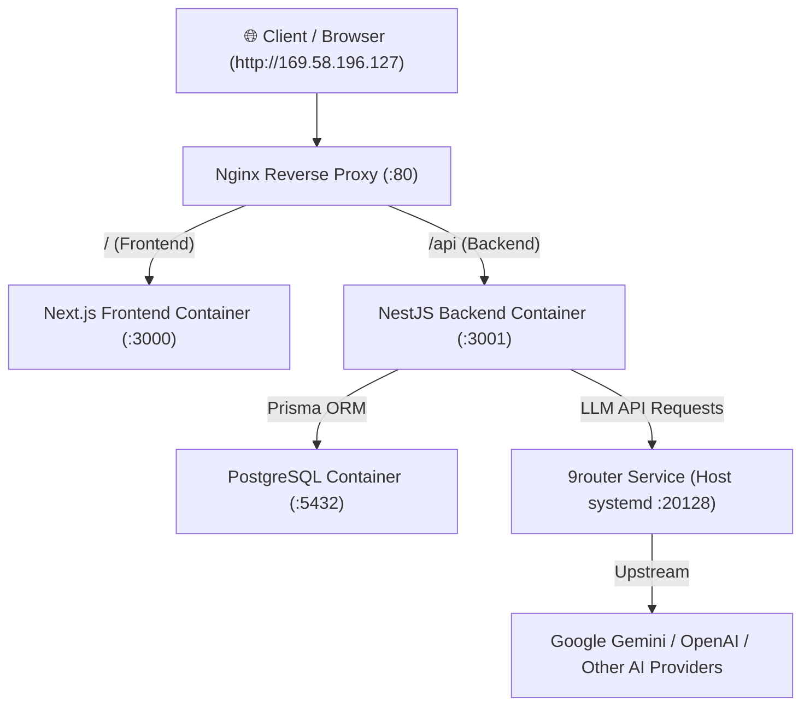

# Panduan Lengkap Deployment NIB Assistant ke Cloud VPS

Panduan ini mendokumentasikan seluruh langkah instalasi, konfigurasi, dan deployment sistem **NIB Assistant** beserta **9router (AI Gateway)** pada server VPS (Ubuntu 24.04 LTS).

---

## 1. Arsitektur Deployment

Sistem dijalankan menggunakan perpaduan **Docker Compose** dan **Systemd Service**:



- **Nginx Reverse Proxy**: Menerima request di port `80`, meneruskan routing `/` ke Next.js dan `/api/` ke NestJS backend.
- **Next.js Frontend**: Berjalan di container port `3000`.
- **NestJS Backend**: Berjalan di container port `3001` dengan engine Playwright headless + dependencies Chromium terisolasi.
- **PostgreSQL**: Database container dengan persistent volume `pgdata`.
- **9router**: Berjalan sebagai service background `systemd` pada host VPS di port `20128`.

---

## 2. Persiapan Server VPS (Host)

### 2.1 Update System & Paket Esensial
```bash
sudo apt-get update && sudo apt-get upgrade -y
sudo apt-get install -y curl wget git unzip build-essential ufw rsync
```

### 2.2 Instalasi Docker & Docker Compose
Instal Docker Engine resmi untuk Ubuntu 24.04:
```bash
# Hapus paket lama jika ada
for pkg in docker.io docker-doc docker-compose docker-compose-v2 podman-docker containerd runc; do sudo apt-get remove -y $pkg; done

# Tambahkan GPG key resmi Docker
sudo install -m 0755 -d /etc/apt/keyrings
sudo curl -fsSL https://download.docker.com/linux/ubuntu/gpg -o /etc/apt/keyrings/docker.asc
sudo chmod a+r /etc/apt/keyrings/docker.asc

# Tambahkan repository ke sumber Apt
echo \
  "deb [arch=$(dpkg --print-architecture) signed-by=/etc/apt/keyrings/docker.asc] https://download.docker.com/linux/ubuntu \
  $(. /etc/os-release && echo "$VERSION_CODENAME") stable" | \
  sudo tee /etc/apt/sources.list.d/docker.list > /dev/null

sudo apt-get update
sudo apt-get install -y docker-ce docker-ce-cli containerd.io docker-buildx-plugin docker-compose-plugin

# Aktifkan dan jalankan docker service
sudo systemctl enable --now docker
```

---

## 3. Instalasi & Konfigurasi 9router (AI Gateway)

### 3.1 Instal Node.js 22 LTS
```bash
curl -fsSL https://deb.nodesource.com/setup_22.x | sudo -E bash -
sudo apt-get install -y nodejs
```

### 3.2 Instal 9router Global
```bash
sudo npm install -g 9router
```

### 3.3 Setup Systemd Service untuk 9router
Buat file service `/etc/systemd/system/9router.service`:
```ini
[Unit]
Description=9router AI Gateway Service
After=network.target

[Service]
Type=simple
User=root
ExecStart=/usr/bin/9router -H 0.0.0.0 -p 20128 --no-browser --skip-update
Restart=always
RestartSec=5
Environment=NODE_ENV=production

[Install]
WantedBy=multi-user.target
```

Jalankan dan aktifkan service:
```bash
sudo systemctl daemon-reload
sudo systemctl enable --now 9router.service
sudo systemctl status 9router.service
```

---

## 4. Deployment Aplikasi NIB Assistant

### 4.1 Menyiapkan Direktori & Kode Aplikasi
Clone repositori ke `/opt/nib-assistant`:
```bash
sudo mkdir -p /opt/nib-assistant
cd /opt/nib-assistant
# Pastikan file-file project telah disinkronkan ke direktori ini
```

### 4.2 Build & Jalankan Docker Compose
```bash
cd /opt/nib-assistant
docker compose up -d --build
```

### 4.3 Menjalankan Migrasi Database Prisma
Jalankan migrasi database di dalam container backend:
```bash
docker compose exec backend npx prisma migrate deploy
```

---

## 5. Konfigurasi Firewall & Port

Buka port HTTP dan SSH:
```bash
sudo ufw allow 22/tcp    # SSH
sudo ufw allow 80/tcp    # HTTP Nginx
sudo ufw allow 443/tcp   # HTTPS (jika nanti menggunakan domain)
sudo ufw enable
```

---

## 6. Verifikasi & Pengujian

### 6.1 Cek Status Container
```bash
docker compose ps
```

### 6.2 Uji Akses Service
- **Frontend**: Akses `http://<IP_VPS>/` pada browser.
- **Backend API Health**: `curl http://127.0.0.1/api/`
- **9router Gateway**: `curl http://127.0.0.1:20128/v1/models`

---

## 7. Pemeliharaan & Troubleshooting

### Melihat Log Realtime
```bash
# Log seluruh stack
docker compose logs -f

# Log backend saja (misal untuk trace Playwright)
docker compose logs -f backend

# Log 9router service
journalctl -u 9router.service -f -n 100
```

### Restart Layanan
```bash
# Restart NIB Assistant
docker compose restart

# Restart 9router
sudo systemctl restart 9router.service
```

### Update Kode Terbaru
```bash
cd /opt/nib-assistant
git pull origin main
docker compose up -d --build
docker compose exec backend npx prisma migrate deploy
```
