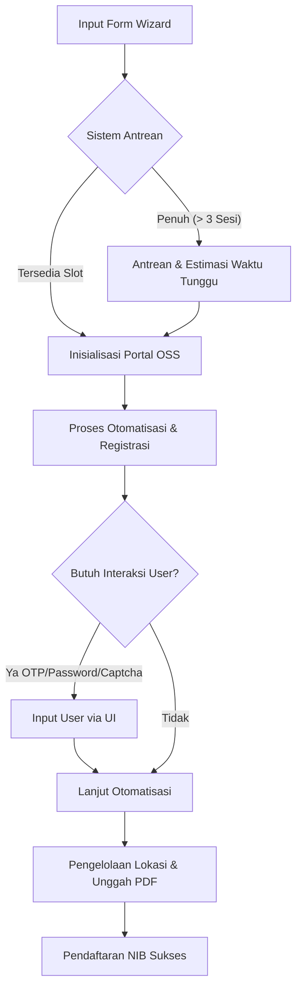

# Panduan Pengguna NIB Assistant

Selamat datang di Panduan Pengguna **NIB Assistant**! Dokumen ini dirancang untuk membantu Anda memahami cara kerja aplikasi, alur pendaftaran NIB (Nomor Induk Berusaha), serta solusi untuk kendala-kendala umum yang mungkin Anda temui saat proses otomatisasi berjalan.

---

## 📌 Pendahuluan
**NIB Assistant** adalah aplikasi pembantu otomatisasi yang mengintegrasikan pengisian data draf usaha Anda secara langsung ke portal resmi **OSS BKPM (oss.go.id)** menggunakan teknologi *browser automation* (Playwright). 

Aplikasi ini menggunakan sistem otomatisasi **hybrid**—artinya, sebagian besar langkah pengisian data dilakukan secara otomatis oleh robot, namun proses verifikasi penting seperti pengisian kode OTP, pembuatan kata sandi, dan penyelesaian CAPTCHA memerlukan interaksi langsung dari Anda sebagai pengguna demi keamanan data.

---

## ⚙️ Bagaimana Cara Kerjanya?

Sistem NIB Assistant bekerja dengan beberapa komponen utama untuk memastikan pendaftaran berjalan aman dan lancar:

### 1. Batas Antrean Pendaftaran
Untuk mencegah akun Anda atau alamat IP diblokir oleh portal resmi OSS BKPM akibat terlalu banyak aktivitas bersamaan, sistem membatasi proses pendaftaran maksimal **3 pendaftaran berjalan sekaligus**. Jika kuota penuh, pendaftaran berikutnya otomatis masuk ke daftar antrean tunggu.

### 2. Perkiraan Waktu Tunggu Pintar
Waktu tunggu yang tertera di layar dihitung berdasarkan rata-rata durasi pendaftaran sukses sebelumnya. Jika sistem baru pertama kali digunakan, perkiraan awal adalah **3 menit per antrean**. Perkiraan ini akan berkurang secara otomatis seiring dengan selesainya pendaftaran di depan Anda.

### 3. Pelindung Pendaftaran Ganda
Sistem melarang satu data draf yang sama didaftarkan lebih dari satu kali secara bersamaan (misalnya Anda membuka halaman pendaftaran di dua tab browser berbeda). Pendaftaran kedua otomatis akan ditolak agar tidak mengacaukan pengisian data yang sedang berjalan.

### 4. Penyelamatan Otomatis Saat Gangguan
Apabila terjadi gangguan koneksi atau server aplikasi terhenti secara tiba-tiba di tengah jalan, semua jendela browser otomatisasi yang sedang berjalan di latar belakang akan otomatis ditutup dengan aman. Hal ini dilakukan demi keamanan akun Anda serta kestabilan server.

---

## 📖 Panduan Langkah demi Langkah

### Langkah 1: Pengisian Formulir Wizard
Isilah formulir data usaha Anda di aplikasi dengan lengkap dan benar (termasuk NIK, Nama KTP, Email, Alamat, Koordinat Lokasi Usaha via peta OpenStreetMap, dan luas lahan). Setelah selesai, klik tombol **"Daftar Otomatis"**.

### Langkah 2: Menunggu Antrean (Jika Penuh)
Jika slot otomatisasi penuh, Anda akan melihat layar tunggu antrean. Anda akan melihat informasi posisi antrean Anda (misalnya: *Posisi Anda: #1*) dan estimasi waktu tunggu (misalnya: *3 menit 20 detik*). **Mohon jangan menutup halaman ini agar koneksi tidak terputus.**

### Langkah 3: Inisialisasi & Validasi Awal
Begitu giliran Anda tiba, robot akan membuka portal OSS BKPM dan mulai mengisi data Anda. Layar Monitor Otomatisasi (Mock Browser) akan menampilkan status pengisian secara real-time.

### Langkah 4: Verifikasi OTP & Pengaturan Kata Sandi
* **Pendaftaran Akun Baru (Belum punya akun OSS)**: 
  1. Robot akan memicu pengiriman OTP ke email Anda.
  2. Layar aplikasi Anda akan memunculkan form input OTP 6-digit beserta waktu mundur (120 detik).
  3. Periksa kotak masuk email Anda, salin kode OTP, masukkan ke aplikasi, lalu klik **"Kirim OTP"**.
  4. Setelah OTP tervalidasi, Anda akan diminta membuat Kata Sandi baru untuk akun OSS Anda. Masukkan kata sandi, lalu klik **"Kirim Kata Sandi"**.
* **Akun Sudah Terdaftar (Sudah memiliki akun OSS)**:
  Robot akan langsung menuju halaman Login.

### Langkah 5: Login & Penyelesaian CAPTCHA
Robot akan memasukkan email/username dan kata sandi Anda. Jika portal OSS memunculkan CAPTCHA keamanan:
1. Selesaikan CAPTCHA tersebut langsung di jendela browser Chrome bantuan yang terbuka di layar.
2. Klik tombol **"Masuk"** di portal OSS, atau laporkan pendaftaran selesai dengan mengklik **"Konfirmasi Selesai Masuk"** di halaman aplikasi NIB Assistant.

### Langkah 6: Pengelolaan Lokasi & Dokumen
Robot akan masuk ke menu lokasi usaha, mengisi koordinat lokasi Anda, mengisi luas tanah, serta secara otomatis menghasilkan dokumen PDF administrasi (Pernyataan Mandiri & Foto Lokasi) dan mengunggahnya ke portal OSS.

### Langkah 7: Selesai
Setelah pendaftaran lokasi tersimpan, proses otomatisasi selesai dengan sukses dan Anda akan dialihkan ke halaman penyelesaian.

---

## ❓ FAQ & Penanganan Kendala (Troubleshooting)

Berikut adalah daftar kendala yang sering ditemui selama proses otomatisasi dan langkah-langkah untuk mengatasinya:

### Kendala 1: NIK Sudah Terdaftar di Portal OSS
* **Gejala**: Terdapat pesan error berwarna merah di log teknis: *"Pendaftaran GAGAL: NIK sudah terdaftar di portal OSS. Silakan masuk menggunakan akun terdaftar Anda."*
* **Penyebab**: NIK Anda sudah pernah digunakan untuk mendaftar akun OSS sebelumnya.
* **Solusi**: 
  1. Klik tombol **"Isi Manual"** atau **"Hentikan Bot"**.
  2. Kembali ke halaman awal pendaftaran, lalu pilih opsi **"Sudah Memiliki Akun OSS"** pada form agar aplikasi langsung memproses login tanpa melakukan registrasi ulang.

### Kendala 2: Email Sudah Terdaftar di Portal OSS
* **Gejala**: Log teknis menampilkan error: *"Pendaftaran GAGAL: Email sudah terdaftar di portal OSS. Silakan gunakan email lain..."*
* **Penyebab**: Alamat email yang Anda masukkan sudah terasosiasi dengan akun OSS lain.
* **Solusi**:
  1. Pada form koreksi yang muncul di layar aplikasi, masukkan alamat **Email Baru** yang belum pernah terdaftar di OSS.
  2. Klik tombol **"Perbarui & Mulai Ulang"** untuk melanjutkan otomatisasi dengan email baru tersebut tanpa harus mengisi ulang seluruh form dari awal.

### Kendala 3: Gagal Tersambung ke Sistem Dukcapil
* **Gejala**: Log teknis menampilkan pesan: *"Pendaftaran GAGAL: Gagal tersambung ke sistem dukcapil Kementerian Dalam Negeri..."*
* **Penyebab**: Server internal Dukcapil Kemendagri sedang mengalami gangguan atau *down*, sehingga portal OSS tidak dapat memverifikasi kesesuaian NIK dan Nama Anda.
* **Solusi**:
  1. Kendala ini murni berasal dari sistem pemerintahan (Dukcapil/OSS).
  2. Tunggu sekitar **5-10 menit**, lalu klik tombol **"Coba Lagi"** pada layar aplikasi untuk mengulangi proses pengisian.

### Kendala 4: Data Tidak Sesuai KTP (Dukcapil Mismatch)
* **Gejala**: Log menampilkan error: *"Pendaftaran GAGAL: Data nama pelaku usaha atau NIK tidak sesuai KTP Dukcapil."*
* **Penyebab**: Terdapat perbedaan ejaan nama atau digit NIK antara data yang Anda ketikkan dengan data resmi di Dukcapil.
* **Solusi**:
  1. Periksa kembali kesesuaian data Anda. Pastikan nama lengkap ditulis menggunakan **huruf kapital** dan sesuai persis dengan fisik KTP (termasuk tanda baca atau gelar jika terdaftar resmi).
  2. Masukkan NIK dan Nama Lengkap yang benar pada form koreksi yang disediakan di layar.
  3. Klik **"Perbarui & Mulai Ulang"**.

### Kendala 5: Kode OTP Tidak Valid atau Kedaluwarsa
* **Gejala**: Log menampilkan error verifikasi OTP atau input OTP tidak merespon di portal.
* **Penyebab**: Kode OTP yang dimasukkan salah, atau waktu pengisian melebihi batas waktu (120 detik) sehingga kode hangus.
* **Solusi**:
  1. Klik tombol **"Kirim Ulang OTP"** di layar aplikasi untuk meminta kode baru.
  2. Periksa kembali email Anda (pastikan memeriksa folder *Spam* atau *Promotions*).
  3. Masukkan kode 6-digit yang baru dengan segera sebelum waktu hitung mundur habis.

### Kendala 6: Kekuatan Kata Sandi Belum Terpenuhi
* **Gejala**: Log menampilkan error kekuatan kata sandi setelah Anda mengklik simpan kata sandi.
* **Penyebab**: Kata sandi baru Anda terlalu lemah atau tidak cocok antara kolom pertama dan kedua. Portal OSS mewajibkan kata sandi memiliki minimal 8 karakter, mengandung huruf besar/kecil, angka, dan karakter spesial (misal: `@`, `#`, `_`, `-`).
* **Solusi**:
  1. Buat kata sandi baru yang lebih kuat (contoh format yang baik: `UsahaSukses2026!`).
  2. Masukkan kembali pada formulir kata sandi di aplikasi dan pastikan konfirmasi kata sandi terisi dengan sama persis.

### Kendala 7: Koneksi Terputus (Server Terhenti/Jaringan Putus)
* **Gejala**: Layar monitor menampilkan status *"Koneksi Terputus"* atau *"Server Tidak Merespons"*.
* **Penyebab**: Koneksi internet Anda terputus, atau server backend aplikasi NIB Assistant mati/sedang direstart.
* **Solusi**:
  1. Pastikan koneksi internet Anda stabil.
  2. Pastikan aplikasi backend NIB Assistant di komputer/server Anda masih menyala (jalankan `npm run dev` pada terminal backend jika mati).
  3. Begitu server aktif kembali, klik tombol **"Coba Lagi"** pada layar monitor untuk menyambungkan kembali SSE stream dan mengulangi langkah pendaftaran secara otomatis.

### Kendala 8: "Sesi otomatisasi untuk data ini sudah berjalan..."
* **Gejala**: Sesi langsung terhenti sesaat setelah terhubung dengan status error *"Sesi otomatisasi untuk data ini sudah berjalan atau sedang mengantre."*
* **Penyebab**: Anda membuka halaman monitor otomatisasi untuk draf yang sama di lebih dari satu tab browser atau perangkat.
* **Solusi**:
  1. Tutup semua tab/jendela browser lain yang sedang membuka halaman otomatisasi NIB Assistant.
  2. Gunakan hanya satu tab aktif untuk memantau proses pendaftaran agar tidak terjadi konflik sesi ganda.

---

> 💡 **Tips Tambahan**: Jika portal OSS sangat lambat atau sering mengalami kendala jaringan (*timeout*), Anda selalu dapat beralih ke pengisian manual dengan mengklik tombol **"Isi Manual"**. Aplikasi akan menyimpan draf Anda di database lokal sehingga Anda dapat menggunakannya sebagai acuan pengisian secara mandiri di portal `oss.go.id`.
