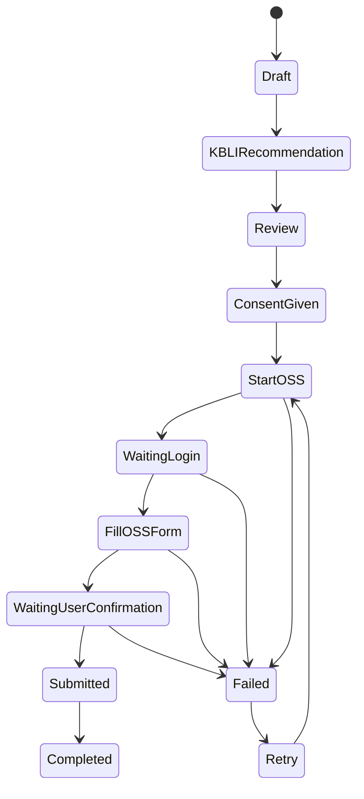

# Product & Technical Brief: NIB Assistant untuk OSS

## 1. Ringkasan Produk

NIB Assistant adalah website tools yang membantu pelaku UMKM membuat Nomor Induk Berusaha (NIB) lewat OSS dengan alur yang lebih sederhana, dipandu, dan minim istilah birokratis.

User mengisi data usaha di website kita, sistem membantu memilih kandidat KBLI yang relevan, menyiapkan data sesuai format OSS, lalu meneruskan pengisian ke OSS melalui automation browser seperti Playwright.

Tujuan utamanya bukan menggantikan OSS, melainkan menjadi lapisan pendamping yang membuat proses OSS terasa lebih mudah untuk UMKM.

## 2. Problem

Pelaku UMKM sering mengalami hambatan berikut:

- Tidak tahu harus memilih KBLI apa.
- Bingung membedakan istilah legal, bidang usaha, produk, kegiatan usaha, skala usaha, dan lokasi usaha.
- Takut salah input karena konsekuensinya terasa formal/legal.
- Merasa OSS terlalu panjang untuk kebutuhan sederhana: hanya ingin punya NIB.
- Tidak terbiasa membaca instruksi pemerintah yang padat dan teknis.
- Sering berhenti di tengah proses karena butuh OTP, login, dokumen, atau klarifikasi data.

## 3. Target User

### Persona Utama

**Pelaku UMKM perorangan**

- Menjual makanan, minuman, jasa, produk rumahan, toko online, warung, laundry, salon, bengkel kecil, jasa digital, dan usaha mikro lain.
- Sudah punya KTP/NIK dan data dasar usaha.
- Belum paham KBLI.
- Ingin NIB untuk marketplace, pengajuan modal, legalitas dasar, kemitraan, atau kebutuhan administrasi.

### Persona Sekunder

**Pendamping UMKM / konsultan lokal**

- Membantu banyak pelaku usaha mendaftar NIB.
- Butuh proses yang lebih cepat, terstruktur, dan konsisten.
- Perlu menyimpan draft, status pengerjaan, dan catatan kendala per user.

## 4. Prinsip Produk

- **User tetap pemilik akun OSS.** Tool tidak boleh mengambil alih identitas user tanpa persetujuan eksplisit.
- **Transparan.** Sebelum automation mengirim data ke OSS, user melihat ringkasan data dan harus menyetujui.
- **Human-in-the-loop.** OTP, captcha, persetujuan legal, dan konfirmasi akhir tetap dilakukan oleh user.
- **Bantu memilih, bukan menjamin.** Rekomendasi KBLI harus disajikan sebagai kandidat dengan alasan, bukan keputusan legal mutlak.
- **Tidak menyimpan kredensial OSS secara permanen.** Jika login dibutuhkan, gunakan sesi browser sementara atau metode user-controlled session.
- **Tahan perubahan.** Karena UI OSS bisa berubah, automation harus punya monitoring, fallback manual, dan error reporting.

## 5. Value Proposition

Untuk UMKM:

- Mengubah proses pembuatan NIB dari "isi formulir panjang" menjadi "jawab pertanyaan sederhana".
- Membantu menemukan KBLI berdasarkan bahasa sehari-hari.
- Mengurangi salah input dengan validasi dan ringkasan sebelum submit.
- Memberi panduan jika ada data yang belum siap.

Untuk pendamping UMKM:

- Mempercepat pendataan.
- Membuat proses lebih repeatable.
- Memudahkan tracking status pembuatan NIB.

## 6. Scope MVP

### In Scope

- Website onboarding user.
- Wizard pengisian data dasar usaha.
- Rekomendasi KBLI berdasarkan deskripsi usaha.
- Konfirmasi data sebelum automation.
- Automation pengisian flow OSS untuk skenario UMKM perorangan sederhana.
- Status tracker proses.
- Error handling jika OSS berubah, login gagal, captcha, OTP, atau data kurang.
- Export ringkasan data dalam PDF/Markdown untuk user.

### Out of Scope untuk MVP

- Pengurusan izin lanjutan selain NIB.
- Badan usaha kompleks seperti PT, CV, yayasan, koperasi.
- Multi-cabang yang kompleks.
- Pengurusan sertifikat standar/izin risiko menengah-tinggi secara otomatis.
- Penyimpanan password OSS permanen.
- Keputusan legal final terkait KBLI.

## 7. User Journey Utama

1. User membuka website NIB Assistant.
2. User memilih tujuan: "Buat NIB untuk usaha saya".
3. User mengisi data pribadi dan data usaha dengan bahasa sederhana.
4. User menjelaskan usaha dalam kalimat bebas.
5. Sistem memberi 3-5 kandidat KBLI beserta alasan kecocokan.
6. User memilih KBLI yang paling sesuai, atau meminta bantuan ulang.
7. Sistem menampilkan ringkasan data yang akan dikirim ke OSS.
8. User menyetujui consent automation.
9. Sistem membuka sesi OSS dan menjalankan pengisian otomatis.
10. User menangani login, OTP, captcha, atau persetujuan final jika muncul.
11. Sistem menampilkan status: selesai, butuh tindakan user, atau gagal.
12. Jika selesai, user mendapat ringkasan NIB dan langkah berikutnya.

## 8. User Stories

### Onboarding

- Sebagai pelaku UMKM, saya ingin tahu apakah tool ini cocok untuk usaha saya, supaya saya tidak membuang waktu mengisi data yang ternyata tidak bisa diproses.
- Sebagai pelaku UMKM, saya ingin melihat estimasi data apa saja yang dibutuhkan, supaya saya bisa menyiapkan KTP, alamat usaha, nomor kontak, dan informasi produk/jasa.
- Sebagai pelaku UMKM, saya ingin menggunakan bahasa sehari-hari, supaya saya tidak perlu memahami istilah OSS sejak awal.

### Pengisian Data Usaha

- Sebagai pelaku UMKM, saya ingin mengisi profil usaha lewat pertanyaan bertahap, supaya proses terasa ringan.
- Sebagai pelaku UMKM, saya ingin sistem memberi contoh jawaban, supaya saya paham cara menjelaskan kegiatan usaha saya.
- Sebagai pelaku UMKM, saya ingin diberi tahu jika data saya kurang lengkap, supaya tidak gagal saat diteruskan ke OSS.
- Sebagai pendamping UMKM, saya ingin menyimpan draft, supaya saya bisa melanjutkan pengisian ketika user belum punya data lengkap.

### Rekomendasi KBLI

- Sebagai pelaku UMKM, saya ingin sistem merekomendasikan KBLI berdasarkan deskripsi usaha saya, supaya saya tidak perlu mencari kode secara manual.
- Sebagai pelaku UMKM, saya ingin melihat alasan kenapa KBLI direkomendasikan, supaya saya bisa memilih dengan lebih percaya diri.
- Sebagai pelaku UMKM, saya ingin melihat contoh usaha yang cocok dan tidak cocok untuk tiap KBLI, supaya saya bisa menghindari pilihan yang salah.
- Sebagai pelaku UMKM, saya ingin memilih lebih dari satu KBLI jika usaha saya memang punya beberapa kegiatan, supaya NIB saya mencerminkan usaha sebenarnya.
- Sebagai sistem, saya perlu memberi disclaimer bahwa rekomendasi KBLI bukan nasihat hukum final, supaya ekspektasi user jelas.

### Review & Consent

- Sebagai pelaku UMKM, saya ingin melihat ringkasan data sebelum dikirim ke OSS, supaya saya bisa memperbaiki kesalahan.
- Sebagai pelaku UMKM, saya ingin menyetujui secara eksplisit bahwa tool akan membantu mengisi OSS, supaya saya merasa aman.
- Sebagai pelaku UMKM, saya ingin tahu bagian mana yang akan otomatis dan bagian mana yang harus saya lakukan sendiri, supaya tidak kaget saat login, OTP, atau captcha.

### Automation OSS

- Sebagai pelaku UMKM, saya ingin data yang sudah saya isi otomatis dipindahkan ke OSS, supaya saya tidak perlu mengetik ulang.
- Sebagai pelaku UMKM, saya ingin automation berhenti saat butuh keputusan legal atau persetujuan final, supaya saya tetap memegang kendali.
- Sebagai pelaku UMKM, saya ingin melihat progress automation secara real-time, supaya saya tahu sistem sedang bekerja.
- Sebagai sistem, saya perlu mendeteksi jika UI OSS berubah, supaya automation tidak salah klik atau salah submit.
- Sebagai sistem, saya perlu menyimpan log teknis tanpa data sensitif berlebihan, supaya error bisa dianalisis tanpa membahayakan privasi user.

### Completion

- Sebagai pelaku UMKM, saya ingin tahu jika NIB berhasil dibuat, supaya saya bisa lanjut memakai NIB tersebut.
- Sebagai pelaku UMKM, saya ingin mendapat ringkasan data dan langkah berikutnya, supaya saya tahu apakah ada kewajiban lanjutan.
- Sebagai pendamping UMKM, saya ingin melihat status tiap user, supaya saya tahu siapa yang selesai, tertunda, atau butuh bantuan.

## 9. Flow UX untuk Google Stitch

### Screen 1: Eligibility Check

Tujuan: memastikan user masuk scope MVP.

Komponen:

- Pilihan tipe pelaku usaha: perorangan / badan usaha.
- Pilihan skala: mikro / kecil / belum tahu.
- Pertanyaan apakah user sudah punya akun OSS.
- CTA: "Mulai buat draft NIB".

State:

- Eligible: lanjut ke wizard.
- Not eligible: tampilkan pesan bahwa tool MVP hanya untuk UMKM perorangan sederhana.

### Screen 2: Business Profile Wizard

Tujuan: mengumpulkan data dengan bahasa sederhana.

Field contoh:

- Nama pemilik usaha.
- NIK atau identitas yang dibutuhkan, dengan masking.
- Nomor HP/email.
- Nama usaha.
- Alamat usaha.
- Bentuk aktivitas: jual produk, produksi, jasa, toko, online, offline.
- Deskripsi bebas: "Ceritakan usaha kamu seperti ngobrol biasa."
- Perkiraan omzet atau skala.
- Jumlah tenaga kerja jika diperlukan.

UX:

- Stepper 4-6 langkah.
- Autosave draft.
- Validasi per langkah.
- Helper text singkat.

### Screen 3: KBLI Recommendation

Tujuan: membantu user memilih KBLI.

Komponen:

- Input ulang/deskripsi usaha.
- Daftar kandidat KBLI.
- Confidence indicator.
- Alasan rekomendasi.
- Contoh kegiatan yang cocok.
- Tombol "Pilih KBLI ini".
- Tombol "Usaha saya bukan ini".

Card KBLI:

- Kode KBLI.
- Nama KBLI.
- Ringkasan bahasa awam.
- Cocok untuk.
- Tidak cocok untuk.
- Risiko/perizinan jika data tersedia.

### Screen 4: Data Review

Tujuan: memastikan user sadar apa yang akan dikirim.

Komponen:

- Ringkasan data pribadi.
- Ringkasan data usaha.
- KBLI terpilih.
- Checklist konfirmasi:
  - Data sudah benar.
  - Saya memahami rekomendasi KBLI adalah bantuan, bukan keputusan legal final.
  - Saya mengizinkan tool membantu mengisi OSS.
  - Saya akan melakukan login/OTP/captcha sendiri jika diminta.

CTA:

- "Lanjut ke OSS dengan automation".
- "Edit data".

### Screen 5: OSS Automation Runner

Tujuan: menjalankan dan memantau automation.

Komponen:

- Browser automation panel atau remote browser preview.
- Progress step:
  - Membuka OSS.
  - Login user.
  - Mengisi data pelaku usaha.
  - Mengisi data usaha.
  - Mengisi KBLI.
  - Review OSS.
  - Menunggu persetujuan user.
  - Selesai.
- Status badge: running, waiting user, failed, completed.
- Tombol pause/stop.
- Tombol "Saya sudah login".

### Screen 6: Result

Tujuan: memberi hasil akhir dan next steps.

Komponen:

- Status: berhasil / butuh tindakan / gagal.
- Jika berhasil:
  - Nomor NIB jika tersedia untuk ditampilkan.
  - Ringkasan usaha.
  - Link ke OSS.
  - Download ringkasan.
- Jika butuh tindakan:
  - Penyebab.
  - Langkah yang harus dilakukan user.
- Jika gagal:
  - Penjelasan awam.
  - Tombol retry.
  - Tombol hubungi support.

## 10. Automation Architecture

### Opsi A: User-Controlled Browser Session

User login sendiri di browser automation yang kita tampilkan. Sistem hanya mengisi form setelah user memberi izin.

Kelebihan:

- Lebih aman untuk kredensial.
- Lebih transparan.
- Cocok untuk OTP/captcha.

Kekurangan:

- UX sedikit lebih teknis.
- Butuh infrastruktur browser session yang stabil.

### Opsi B: Local Browser Automation

Automation berjalan di perangkat user lewat browser extension atau desktop helper.

Kelebihan:

- Data dan session tetap di perangkat user.
- Risiko penyimpanan kredensial lebih rendah.

Kekurangan:

- Instalasi lebih rumit.
- Sulit untuk user UMKM non-teknis.

### Opsi C: Server-Side Browser Automation

Automation berjalan di server menggunakan Playwright.

Kelebihan:

- UX lebih mulus.
- Mudah diobservasi dan di-debug.

Kekurangan:

- Risiko privasi lebih tinggi.
- Harus sangat hati-hati soal kredensial, OTP, captcha, dan compliance.

Rekomendasi MVP: mulai dari **Opsi A**. User tetap login dan mengonfirmasi langkah sensitif sendiri, sementara tool membantu pengisian data.

## 11. Technical Components

### Frontend

- Framework: Next.js atau React.
- UI: wizard form, KBLI recommendation view, review screen, automation monitor.
- State: draft application, selected KBLI, consent, automation status.
- Form validation: Zod/Yup.
- Accessibility: form labels jelas, error message spesifik, mobile-first.

### Backend

- API untuk menyimpan draft.
- API rekomendasi KBLI.
- API orchestration automation.
- Queue untuk menjalankan automation job.
- Audit log.
- Notification status.

### Automation Worker

- Playwright sebagai default.
- Browser context per user/session.
- Selector strategy yang tahan perubahan:
  - prioritas role/label/text selector,
  - fallback CSS selector,
  - screenshot capture saat gagal.
- Step runner berbasis state machine.
- Manual checkpoint untuk login, OTP, captcha, dan final submit.

### KBLI Recommendation Engine

MVP approach:

- Database KBLI internal yang bisa diperbarui.
- Search lexical: keyword, synonym, kategori usaha.
- Optional semantic search: embedding dari deskripsi usaha ke daftar KBLI.
- Ranking berdasarkan kecocokan aktivitas, produk/jasa, model usaha, dan pengecualian.
- Output 3-5 kandidat, bukan satu jawaban tunggal.

Future:

- Fine-tuned classifier atau retrieval-augmented generation.
- Feedback loop dari pilihan user dan hasil validasi.
- Admin review untuk KBLI yang sering membingungkan.

## 12. Data Model Awal

### User

- id
- name
- phone
- email
- role: business_owner / assistant / admin
- created_at

### ApplicationDraft

- id
- user_id
- status: draft / ready_for_review / automation_running / waiting_user / completed / failed
- owner_profile
- business_profile
- selected_kbli_codes
- consent_status
- created_at
- updated_at

### KBLICode

- code
- title
- description
- keywords
- examples
- exclusions
- source_version
- updated_at

### AutomationJob

- id
- application_draft_id
- status
- current_step
- error_code
- error_message
- screenshot_reference
- started_at
- finished_at

### AuditLog

- id
- actor_id
- application_draft_id
- action
- metadata
- created_at

## 13. Automation State Machine

## 14. Error Handling

### Error Types

- OSS unavailable.
- Login gagal.
- OTP/captcha dibutuhkan.
- Data wajib belum lengkap.
- Selector automation tidak ditemukan.
- Field OSS berubah.
- User menghentikan proses.
- KBLI tidak ditemukan atau ambigu.
- Final submit membutuhkan persetujuan manual.

### UX Error Copy

Gunakan bahasa awam:

- "OSS sedang tidak bisa dibuka. Coba lagi beberapa menit lagi."
- "Kami butuh kamu login dulu di OSS."
- "Ada langkah keamanan dari OSS yang harus kamu selesaikan sendiri."
- "Tampilan OSS berubah, jadi automation berhenti agar tidak salah isi."
- "Data alamat usaha belum lengkap."

## 15. Compliance & Risk Notes

Hal yang wajib diperhatikan:

- Pastikan penggunaan automation tidak melanggar ketentuan layanan OSS.
- Jangan menyimpan password OSS secara permanen.
- Jangan mencoba melewati captcha, OTP, atau kontrol keamanan.
- Jangan melakukan final submission tanpa persetujuan eksplisit user.
- Simpan data sensitif seminimal mungkin.
- Enkripsi data identitas dan draft yang sensitif.
- Beri audit trail untuk setiap tindakan automation.
- Beri disclaimer bahwa tool adalah asisten pengisian, bukan penasihat hukum.
- Siapkan mode manual jika automation tidak bisa berjalan.

## 16. Success Metrics

- Completion rate pembuatan draft.
- Persentase user yang berhasil memilih KBLI.
- Persentase automation completed tanpa intervensi support.
- Drop-off rate per step.
- Waktu rata-rata dari mulai sampai siap submit.
- Jumlah kasus KBLI ambigu.
- Jumlah failure karena perubahan UI OSS.
- CS/support ticket per 100 aplikasi.

## 17. MVP Acceptance Criteria

- User bisa membuat draft NIB untuk UMKM perorangan sederhana.
- User bisa mendapatkan minimal 3 kandidat KBLI dari deskripsi usaha.
- User bisa memilih KBLI dan melihat alasan rekomendasi.
- User bisa review semua data sebelum automation.
- User harus memberi consent sebelum automation dimulai.
- Automation bisa membuka OSS dan mengisi field yang sudah dipetakan untuk flow MVP.
- Automation berhenti saat login, OTP, captcha, atau final confirmation.
- Jika automation gagal, user mendapat alasan yang jelas dan opsi retry/manual.
- Sistem tidak menyimpan password OSS.

## 18. Design Direction

Tone desain:

- Bersih, aman, dan tidak intimidating.
- Bahasa Indonesia sehari-hari.
- Mobile-first karena banyak UMKM memakai HP.
- Hindari tampilan seperti dashboard pemerintah yang padat.
- Pakai wizard bertahap dengan progress jelas.
- Gunakan warna yang memberi rasa aman dan administratif-modern, bukan terlalu playful.

Komponen visual utama:

- Stepper horizontal/vertical.
- Form card sederhana.
- KBLI recommendation cards.
- Confidence indicator.
- Review checklist.
- Automation progress timeline.
- Status result page.

## 19. Suggested Pages for Stitch

1. `/` - eligibility and start screen.
2. `/draft/new` - business profile wizard.
3. `/draft/:id/kbli` - KBLI recommendation.
4. `/draft/:id/review` - review and consent.
5. `/draft/:id/automation` - OSS automation monitor.
6. `/draft/:id/result` - result and next steps.
7. `/dashboard` - optional for pendamping UMKM.

## 20. Prompt Ringkas untuk Google Stitch

Buat desain website mobile-first bernama "NIB Assistant" untuk membantu pelaku UMKM membuat NIB melalui OSS. Produk ini memakai wizard sederhana untuk mengumpulkan data usaha, merekomendasikan KBLI dari deskripsi usaha bahasa sehari-hari, menampilkan review data, meminta consent, lalu menampilkan progress automation pengisian OSS. Desain harus terasa aman, modern, administratif, dan mudah dipakai oleh pelaku UMKM non-teknis. Buat halaman: eligibility check, business profile wizard, KBLI recommendation cards, data review with consent checklist, automation progress monitor, dan result page. Gunakan bahasa Indonesia yang sederhana, komponen form yang jelas, status stepper, dan error states yang ramah.

## 21. Referensi Awal

- OSS KBLI: https://oss.go.id/id/kbli
- Panduan Pembuatan NIB OSS: https://s3.oss.go.id/oss/cms/Panduan-Pembuatan-NIB-0ee67823e1f8138ce764ef9a9b7df77d.pdf
- Panduan Aplikasi OSS Indonesia: https://s3.oss.go.id/oss/cms/Panduan-Aplikasi-OSS-Indonesia.docx-53451cf01ed8874a2bbb8fa644db522e.pdf

